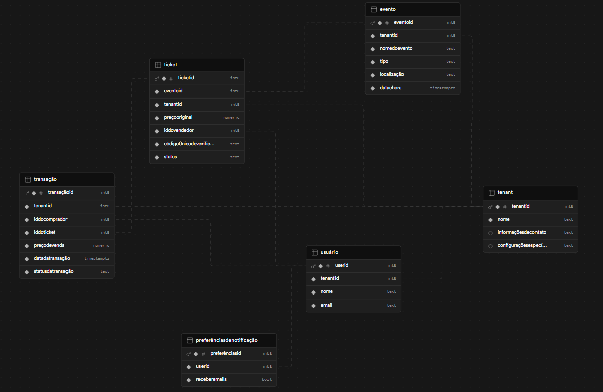

# csw24-grupoG-ticket-gin

Trabalho da disciplina de construção de software da PUCRS 2024/2

## Alunos

- Caio Batista
- Eduardo Garcia
- Eduardo Riboli
- João Schwingel
- Jocemar Nicolodi

## Como rodar

### Sem docker

```bash
go run main.go
```

### Com docker

```bash
csw24-grupoG-ticket-gin % docker build -t csw24-grupog-ticket-gin-we .```

```bash
docker run -d -p 8080:8080 --name ticket-gin-container csw24-grupog-ticket-gin-we
```

OBS: Para erro "go mod tidy", rodar os seguintes comandos

```bash
go mod download

go mod tidy
go mod download
```

## Data model



## To do's

- [ X ] Criar estrutura do projeto
- [ X ] Criar estrutura das pastas/arquitetura
- [ X ] Instalar uma ORM com um banco de dados
- [ X ] Instalar o Swagger
- [  ] Criar todas as entities do datamodel com a ORM de Go
- [  ] [Criar endpoint do useCase 1: Compra de ingresso](https://github.com/tecmx/csw242-system-docs/blob/main/UseCases.md#1-compra-de-ingresso) 
- [  ] [Criar endpoint do useCase 2: Venda de ingresso](https://github.com/tecmx/csw242-system-docs/blob/main/UseCases.md#2-venda-de-ingresso)
- [  ] [Criar endpoint do useCase 3: Gerenciamento de Eventos (Administrador)](https://github.com/tecmx/csw242-system-docs/blob/main/UseCases.md#3-gerenciamento-de-eventos-administrador)
- [  ] [Criar endpoint do useCase 4: Autenticação de Ingresso no Evento](https://github.com/tecmx/csw242-system-docs/blob/main/UseCases.md#4-autentica%C3%A7%C3%A3o-de-ingresso-no-evento)
- [  ] [Criar endpoint do useCase 5: Gestão de Preferências de Notificação](https://github.com/tecmx/csw242-system-docs/blob/main/UseCases.md#5-gest%C3%A3o-de-prefer%C3%AAncias-de-notifica%C3%A7%C3%A3o)
- [  ] [Criar endpoint do useCase 6: Reembolso de Ingresso](https://github.com/tecmx/csw242-system-docs/blob/main/UseCases.md#6-reembolso-de-ingresso)
- [  ] [Criar endpoint do useCase 7: Envio de Avaliação do Vendedor](https://github.com/tecmx/csw242-system-docs/blob/main/UseCases.md#7-envio-de-avalia%C3%A7%C3%A3o-do-vendedor)
- [  ] [Criar endpoint do useCase 8: Visualização de Avaliações do Vendedor](https://github.com/tecmx/csw242-system-docs/blob/main/UseCases.md#8-visualiza%C3%A7%C3%A3o-de-avalia%C3%A7%C3%B5es-do-vendedor)
- [  ] Instalar o Docker e fazer rodar tudo no local
- [  ] Rodando local, mudamos para um banco de dados na nuvem, para melhor escalabilidade (Tinhamos combinado que seria o RDS da AWS)
- [  ] Conectamos nossa aplicação com Docker à esse banco na nuvem e nos certificamos que esteja tudo rodando 
- [  ] Criar a infraestrutura da AWS com o Terraform
- [  ] Subir a aplicação na AWS
- [  ] Ser feliz